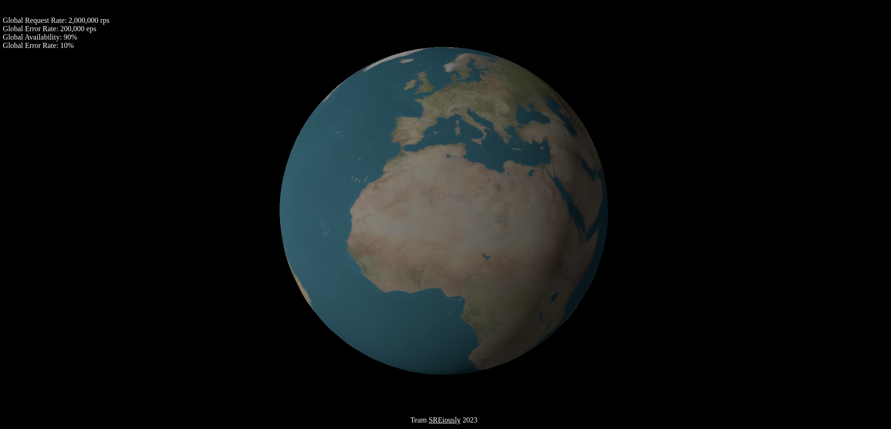

# reliability_globe
Reliability Globe (Final name tbc.) is an observability tool for reliability related telemetry.  For global service deployments, realiability globe will attempt to provide the following:

* High level telemetry
  * Requests per second
  * Errors per second
  * Availability %
  * Error Rate %

In addition to the above high level telemetry (seen at the top left of the example image), realibility globe will also aim to provide the following functionality as time progresses:

* Per region / location nodes with drill down options
* Earth split with option to show various items including datacenters, service names etc.

## Progress so far
